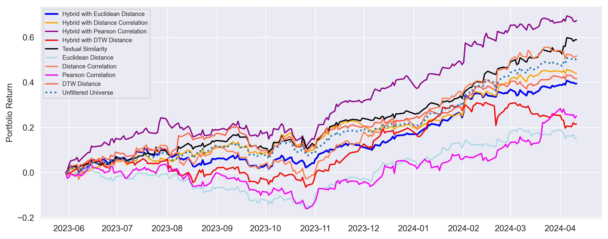
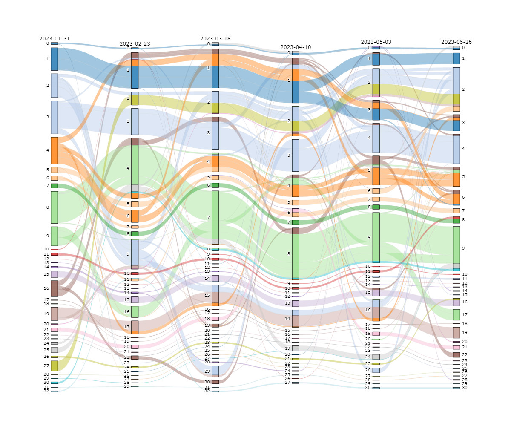
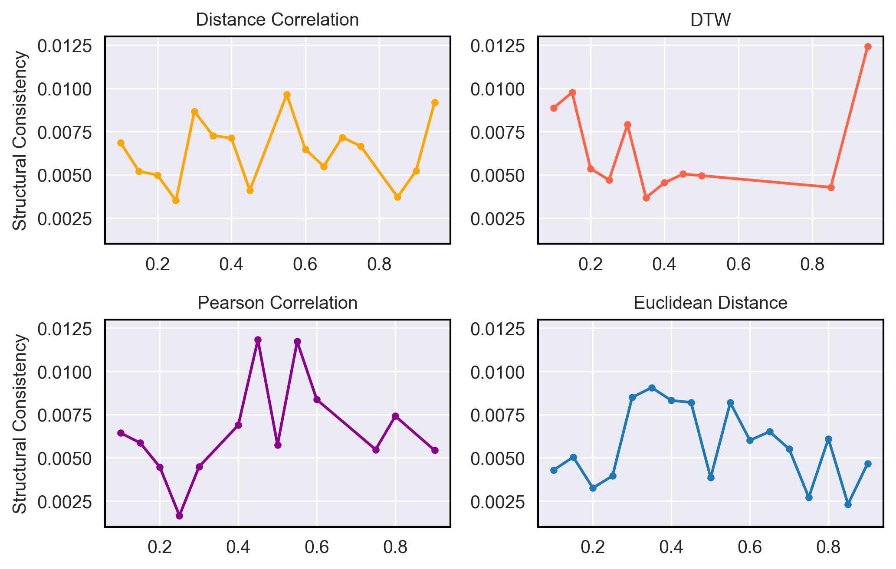
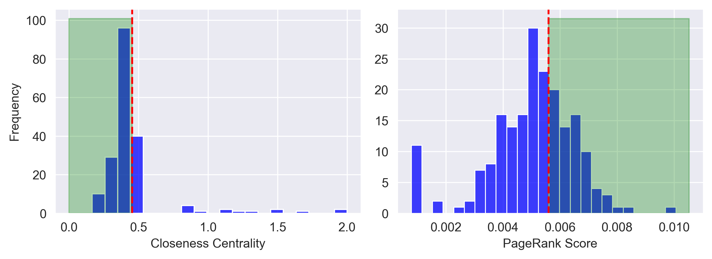

# InUCoN

<h3>Asset Subsets Identification via Investment Universe 
Complex Network</h3>

In financial markets, investors grapple with selecting the optimal subset of 
assets from a vast range of options. This is a challenging task because the system 
changes dynamically depending on various different factors. This study aims to identify an 
optimal subset of assets by ensuring diversity through company description and price behavior 
over time, which are two important characteristics of assets. We introduce the 
Investment Universe Complex Network (InUCoN) framework, integrating these aspects to address previous
limitations. The main strategy of InUCoN is to treat the investment universe as a complex system, 
model it with a complex network, and analyze it using this model. 
The framework has three components: (i) dynamic network generation; (ii) snapshot aggregation; 
and (iii) investment universe filtering. The experiments on the 200 stocks with the highest 
average trading volume from the S&P 500 demonstrate that InUCoN effectively 
reduced risk by selecting a more independent set of stocks, as evidenced by improved portfolio 
performance metrics.

</img>
</img>
</img>
</img>